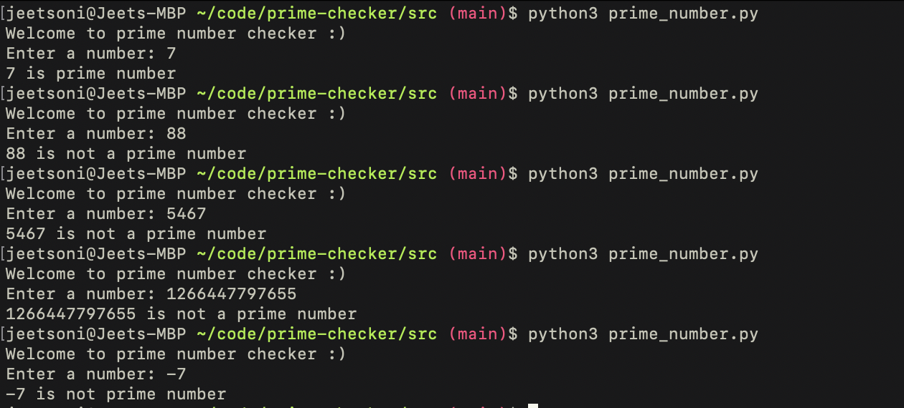

# prime checker
*By: Jeet Soni*

*Date: 08/03/2023*

### **Description**

Want to know if your numbers are prime? Well, you have come to the right place. This program will tell you if your numbers are prime or not. I know some of us have forgot prime numbers past first 10 numbers. Well, worry not, my prime checker got you covered.

### **Write a script to see if a number is a prime number.**

First, I asked user to provide me with a number and converted that to integer using int(). I took that number and checked if the number is 1. If yes, then it's is not a prime number. I used elif() statement to check if number is more than 1. If yes, then I loop through each number starting from 2 until 1 less than the number user entered using the range() function. I used if statements inside the for loop to check if the remainder is 0 every time the loop runs as it divides each user's number with each number in for loop. If yes, then it is "not" a prime number. If not, then it is a prime number. 

If user entered number less than 0, it will say it's not prime number. 

### **Does it work?**

### **Conclusion** 

This was a fun little project while i'm learning python. I learned how to implement logic to solve the problem. 

Open for suggestion

Jeet Soni,

Enjoy

